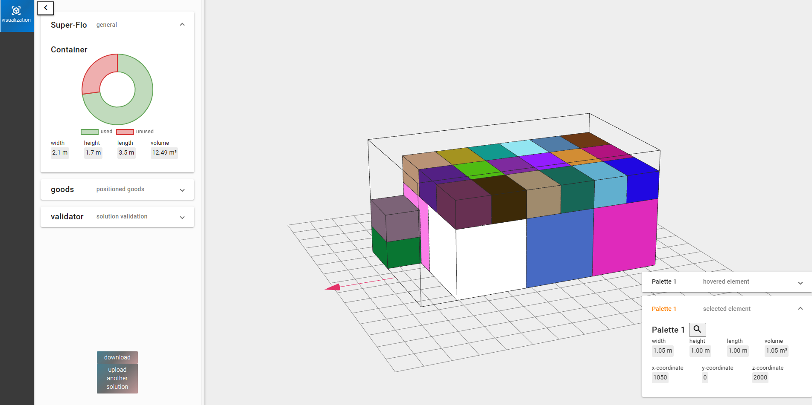

# Binpacking-Visualizer

The application is based on https://github.com/SebLeich/storage-manager-2.0 and written with TypeScript (Angular) and three.js.

Currently it is only used to visualize the results of the bin packing algorithms.

## Development server

Run `ng serve` for a dev server. Navigate to `http://localhost:4200/`. The application will automatically reload if you change any of the source files.

## Code scaffolding

Run `ng generate component component-name` to generate a new component. You can also use `ng generate directive|pipe|service|class|guard|interface|enum|module`.

## Build

Run `ng build` to build the project. The build artifacts will be stored in the `dist/` directory.

## Running unit tests

Run `ng test` to execute the unit tests via [Karma](https://karma-runner.github.io).

